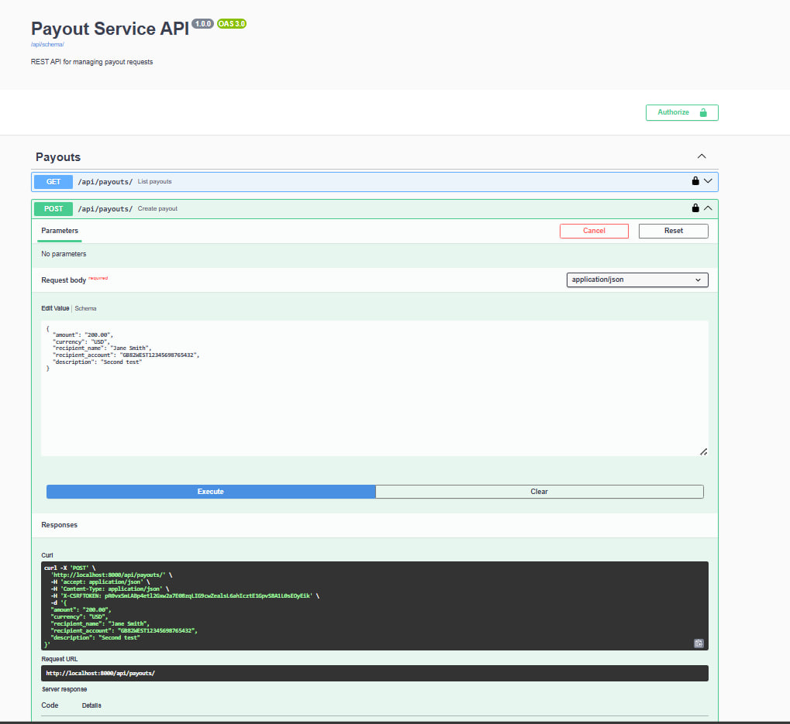
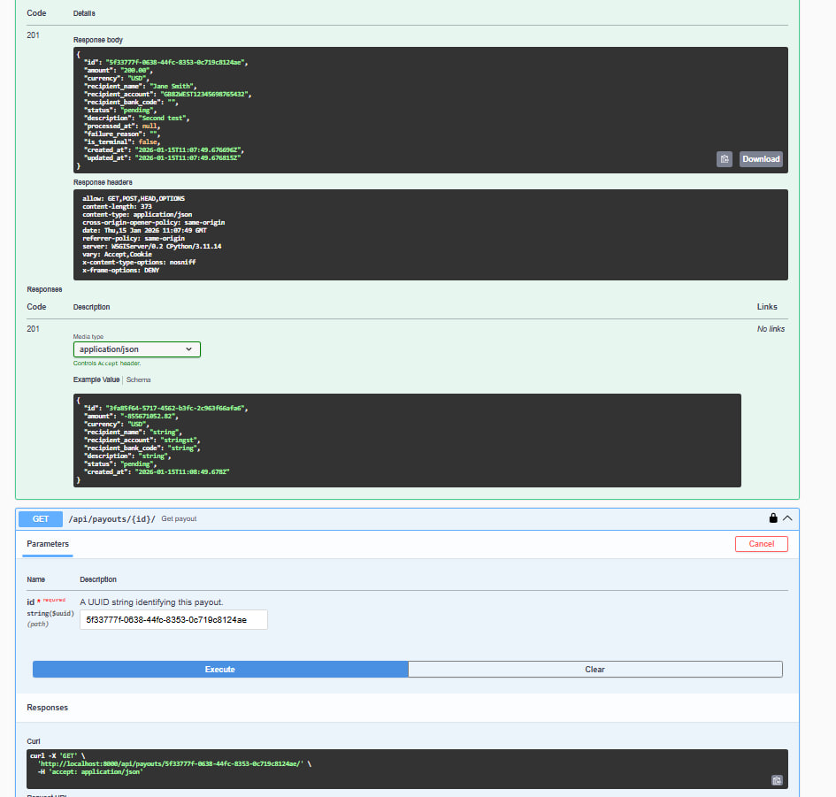
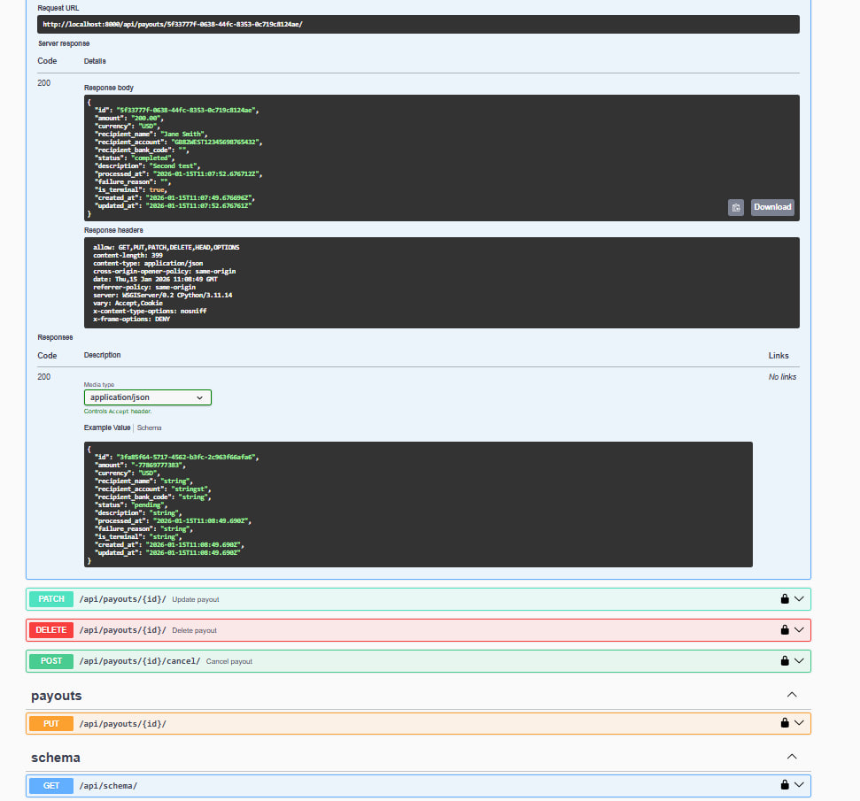

# Payout Service


**GitHub:** https://github.com/koomatoz/payout-service

REST API для управления заявками на выплату средств.

## 🛠 Технологии

- Python 3.11
- Django 4.2 + Django REST Framework
- Celery + Redis
- PostgreSQL
- Docker & Docker Compose

---

## 🚀 Быстрый старт

```bash
# Клонировать репозиторий
git clone https://github.com/koomatoz/payout-service.git
cd payout-service

# Запустить все сервисы
docker-compose up --build
```

**API доступен:** http://localhost:8000/api/payouts/

**Swagger документация:** http://localhost:8000/api/docs/

---

## 📋 API Endpoints

| HTTP Method | Endpoint                     | Description            |
|------------:|------------------------------|------------------------|
| **GET**     | `/api/payouts/`              | Список заявок          |
| **POST**    | `/api/payouts/`              | Создать заявку         |
| **GET**     | `/api/payouts/{id}/`         | Получить заявку        |
| **PATCH**   | `/api/payouts/{id}/`         | Обновить заявку        |
| **DELETE**  | `/api/payouts/{id}/`         | Удалить заявку         |
| **POST**    | `/api/payouts/{id}/cancel/`  | Отменить заявку        |


---

## 🧪 Тестирование

```bash
# Запустить тесты
docker-compose exec web pytest

# С покрытием
docker-compose exec web pytest --cov

# Локально (после установки зависимостей)
cd src && pytest -v
```

---


## 🚀 Production Deployment - Полное руководство

### Архитектура

```
Internet → Nginx:443 (SSL) → Gunicorn:8000 → Django
                                ↓
                          PostgreSQL:5432
                                ↓
                          Redis:6379 ← Celery Workers (x4)
```

### Необходимые сервисы

1. **PostgreSQL** - основная база данных
2. **Redis** - брокер сообщений Celery
3. **Nginx** - reverse proxy + SSL
4. **Gunicorn** - WSGI сервер
5. **Celery Worker** - обработка задач (4+ воркера)
6. **Celery Beat** - планировщик задач

### Требования к серверу

**Минимум:**
- Ubuntu 22.04 LTS
- 2 CPU cores
- 4 GB RAM
- 40 GB SSD

**Рекомендуется:**
- 4 CPU cores
- 8 GB RAM
- 80 GB SSD
- Автоматические бэкапы

---

### Шаг 1: Подготовка сервера

#### 1.1 Подключение и обновление

```bash
ssh root@your-server-ip
apt update && apt upgrade -y
apt install -y curl git vim htop ufw
```

#### 1.2 Установка Docker

```bash
curl -fsSL https://get.docker.com | sh
docker --version
docker compose version
```

#### 1.3 Настройка Firewall

```bash
ufw allow 22/tcp   # SSH
ufw allow 80/tcp   # HTTP
ufw allow 443/tcp  # HTTPS
ufw --force enable
```

#### 1.4 Создание пользователя

```bash
useradd -m -s /bin/bash deploy
usermod -aG docker deploy
su - deploy
```

---

### Шаг 2: Клонирование проекта

```bash
cd ~
git clone https://github.com/koomatoz/payout-service.git
cd payout-service
```

---

### Шаг 3: Настройка окружения

#### 3.1 Создать .env.prod

```bash
cp .env.example .env.prod
nano .env.prod
```

#### 3.2 Важные параметры

```env
DEBUG=False
SECRET_KEY=<генерируйте_команд_ниже>
ALLOWED_HOSTS=your-domain.com,your-ip

POSTGRES_DB=payout_prod
POSTGRES_USER=payout_user
POSTGRES_PASSWORD=<сильный_пароль>
POSTGRES_HOST=db

CELERY_BROKER_URL=redis://redis:6379/0
CELERY_RESULT_BACKEND=redis://redis:6379/0
```

**Генерация SECRET_KEY:**

```bash
python3 -c "import secrets; print(secrets.token_urlsafe(50))"
```

---

### Шаг 4: Production Docker Compose

#### 4.1 Создать docker-compose.prod.yml

```yaml
version: '3.9'

services:
  web:
    build: .
    restart: always
    expose:
      - "8000"
    env_file: .env.prod
    depends_on:
      db:
        condition: service_healthy
    volumes:
      - static_volume:/app/staticfiles
    command: gunicorn --bind 0.0.0.0:8000 --workers 4 --chdir src config.wsgi:application

  db:
    image: postgres:15-alpine
    restart: always
    volumes:
      - postgres_data:/var/lib/postgresql/data
      - ./backups:/backups
    env_file: .env.prod
    healthcheck:
      test: ["CMD-SHELL", "pg_isready -U $$POSTGRES_USER"]
      interval: 10s

  redis:
    image: redis:7-alpine
    restart: always
    volumes:
      - redis_data:/data

  celery_worker:
    build: .
    restart: always
    env_file: .env.prod
    depends_on:
      - db
      - redis
    command: bash -c "cd src && celery -A config worker -l INFO --concurrency=4"

  nginx:
    image: nginx:alpine
    restart: always
    ports:
      - "80:80"
      - "443:443"
    volumes:
      - ./nginx/nginx.conf:/etc/nginx/conf.d/default.conf
      - static_volume:/app/staticfiles
    depends_on:
      - web

volumes:
  postgres_data:
  redis_data:
  static_volume:
```

---

### Шаг 5: Настройка Nginx

#### 5.1 Создать конфигурацию

```bash
mkdir -p nginx
nano nginx/nginx.conf
```

```nginx
upstream django {
    server web:8000;
}

server {
    listen 80;
    server_name your-domain.com;

    location /static/ {
        alias /app/staticfiles/;
        expires 30d;
    }

    location / {
        proxy_pass http://django;
        proxy_set_header Host $host;
        proxy_set_header X-Real-IP $remote_addr;
        proxy_set_header X-Forwarded-For $proxy_add_x_forwarded_for;
        proxy_set_header X-Forwarded-Proto $scheme;
        
        # Таймауты для финтех
        proxy_connect_timeout 300s;
        proxy_read_timeout 300s;
    }

    # Security headers
    add_header X-Frame-Options "DENY";
    add_header X-Content-Type-Options "nosniff";
}
```

---

### Шаг 6: SSL сертификат (Let's Encrypt)

```bash
# Установить certbot
apt install -y certbot

# Получить сертификат
certbot certonly --standalone -d your-domain.com

# Обновить nginx.conf для HTTPS (добавить ssl_certificate строки)
```

---

### Шаг 7: Запуск Production

#### 7.1 Сборка и запуск

```bash
docker compose -f docker-compose.prod.yml build
docker compose -f docker-compose.prod.yml up -d
```

#### 7.2 Миграции и статика

```bash
docker compose -f docker-compose.prod.yml exec web python src/manage.py migrate
docker compose -f docker-compose.prod.yml exec web python src/manage.py collectstatic --noinput
docker compose -f docker-compose.prod.yml exec web python src/manage.py createsuperuser
```

#### 7.3 Проверка

```bash
docker compose -f docker-compose.prod.yml ps
docker compose -f docker-compose.prod.yml logs -f
curl http://your-domain.com/api/payouts/
```

---

### Шаг 8: Бэкапы БД

#### 8.1 Создать скрипт

```bash
mkdir -p backups
nano backups/backup.sh
```

```bash
#!/bin/bash
BACKUP_DIR="/home/deploy/payout-service/backups"
DATE=$(date +%Y%m%d_%H%M%S)

docker compose -f docker-compose.prod.yml exec -T db \
    pg_dump -U payout_user payout_prod | gzip > $BACKUP_DIR/db_$DATE.sql.gz

find $BACKUP_DIR -name "*.sql.gz" -mtime +30 -delete
echo "Backup: db_$DATE.sql.gz"
```

#### 8.2 Автоматизация

```bash
chmod +x backups/backup.sh
crontab -e

# Добавить строку (ежедневно в 3:00):
0 3 * * * /home/deploy/payout-service/backups/backup.sh
```

---

### Шаг 9: Мониторинг

#### 9.1 Просмотр логов

```bash
# Все сервисы
docker compose -f docker-compose.prod.yml logs -f

# Конкретный сервис
docker compose -f docker-compose.prod.yml logs -f web
docker compose -f docker-compose.prod.yml logs -f celery_worker
```

#### 9.2 Мониторинг ресурсов

```bash
docker stats
htop
```

---

### Шаг 10: Обновление приложения

```bash
cd ~/payout-service
git pull origin main
docker compose -f docker-compose.prod.yml build
docker compose -f docker-compose.prod.yml up -d
docker compose -f docker-compose.prod.yml exec web python src/manage.py migrate
```

---

### Масштабирование

#### Увеличение Celery workers

```bash
docker compose -f docker-compose.prod.yml up -d --scale celery_worker=8
```

#### Горизонтальное масштабирование

Использовать:
- Managed PostgreSQL (AWS RDS, DigitalOcean Managed DB)
- Managed Redis (AWS ElastiCache, Redis Cloud)
- Load Balancer (Nginx + несколько Django инстансов)
- Kubernetes для оркестрации

---

### Production Checklist

- ✅ DEBUG=False
- ✅ Сильный SECRET_KEY
- ✅ HTTPS/SSL
- ✅ Firewall настроен
- ✅ Автоматические бэкапы
- ✅ Health checks
- ✅ Мониторинг логов
- ✅ Restart политика
- ✅ Rate limiting (опционально)
- ✅ CDN для статики (опционально)

---

### Безопасность

1. **Регулярные обновления:**
   ```bash
   apt install unattended-upgrades
   ```

2. **Fail2Ban (защита от брутфорса):**
   ```bash
   apt install fail2ban
   ```

3. **Мониторинг:**
   - Sentry для отслеживания ошибок
   - Prometheus + Grafana для метрик
   - ELK Stack для логов

4. **Бэкапы:**
   - Автоматические ежедневные бэкапы
   - Хранение бэкапов на отдельном сервере
   - Тестирование восстановления

---

### Полезные команды

```bash
# Рестарт
docker compose -f docker-compose.prod.yml restart

# Остановка
docker compose -f docker-compose.prod.yml down

# Проверка конфигурации
docker compose -f docker-compose.prod.yml config

# Очистка (ОСТОРОЖНО!)
docker system prune -a
```

---

## 📸 Скриншоты работы API

### Swagger UI


### Создание заявки (201 Created)


### Обработанная заявка (Completed)
